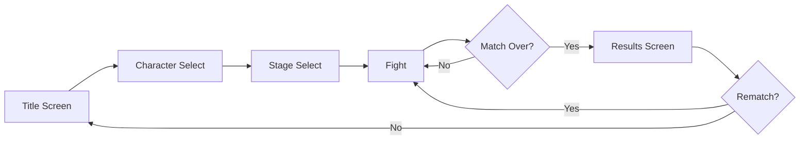
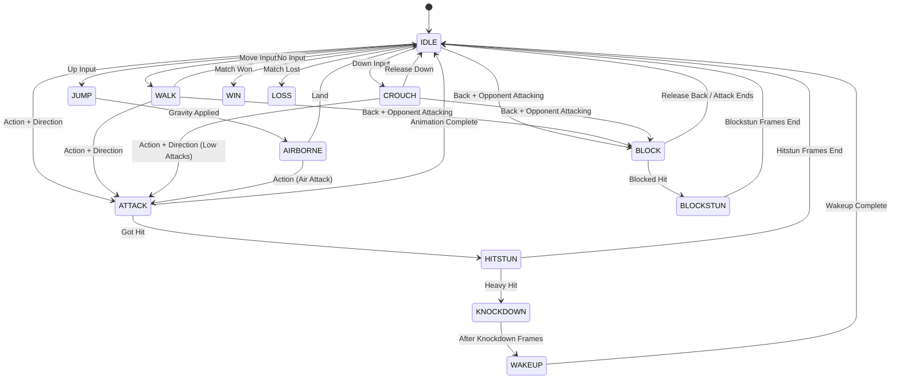
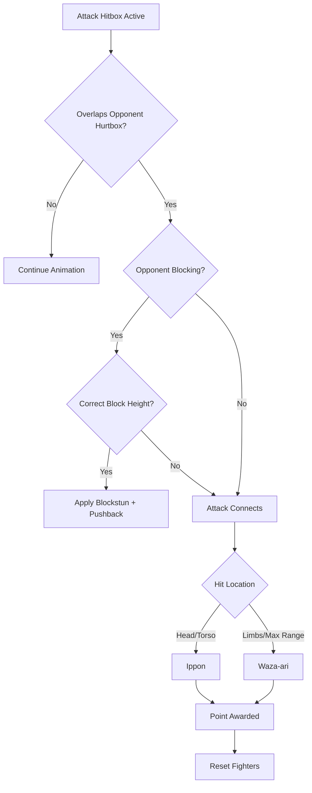
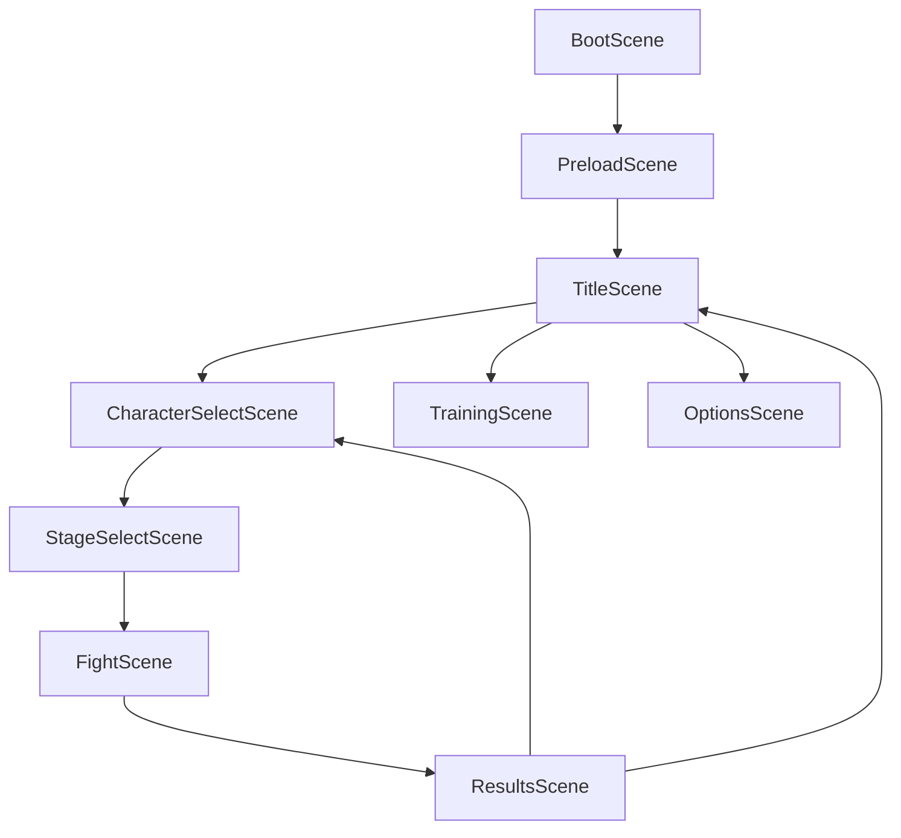

# Technical Specification: *Iron Fist Web*

> **A high-resolution, browser-based martial arts fighting game built with Phaser 3**

---

## Overview

| Property | Value |
|----------|-------|
| **Engine** | Phaser 3 (Canvas/WebGL) |
| **Language** | TypeScript |
| **Resolution** | 1920×1080 (16:9) |
| **Target FPS** | 60 |
| **Input Style** | 8-Directional + Single Action Button |

---

## 1. Game Flow & Screens



### 1.1 Title Screen
- Game logo with animated background
- Menu options: **VS Mode**, **Training**, **Options**, **Credits**
- Press START prompt with pulse animation

### 1.2 Character Select
- Display character portraits in a grid
- Show character name, fighting style, and stats preview
- P1 selects from left, P2 from right (or CPU toggle)

### 1.3 Stage Select
- Thumbnail previews of available stages
- Random select option

### 1.4 Pause Menu
- Resume, Restart Match, Return to Character Select, Quit to Title
- Triggered by `Escape` or `P` key

---

## 2. Match Structure

### 2.1 Round System

| Setting | Value |
|---------|-------|
| **Rounds to Win** | 2 (Best of 3) |
| **Round Time Limit** | 60 seconds |
| **Time Over Resolution** | Player with more points wins; if tied, sudden death |

### 2.2 Scoring System (Ippon Rules)

| Score Type | Points | Condition |
|------------|--------|-----------|
| **Ippon** | 1.0 | Clean hit to head/torso while opponent is not blocking |
| **Waza-ari** | 0.5 | Hit to limbs OR hit at maximum hitbox range |
| **Yuko** | 0.25 | Blocked hit that causes chip/pushback |

- **Round Win:** First to **2 Ippon** (or equivalent in Waza-ari)
- **State Reset:** On successful scoring hit, pause 500ms, show "Point Awarded" UI, reset fighters to starting positions

### 2.3 Match Manager Class

```typescript
interface MatchState {
  currentRound: number;
  roundsToWin: number;
  scores: { p1: number; p2: number };
  roundWins: { p1: number; p2: number };
  timeRemaining: number;
  isPaused: boolean;
  isRoundActive: boolean;
}
```

---

## 3. Fighter State Machine

The core of each fighter is a **Finite State Machine (FSM)**. A fighter can only be in one state at a time.



### 3.1 State Definitions

| State | Description | Input Allowed | Duration |
|-------|-------------|---------------|----------|
| **IDLE** | Default standing state | All | Indefinite |
| **WALK** | Moving forward/backward | Attack, Block | While input held |
| **CROUCH** | Ducking position (avoids high attacks) | Low Attack, Block | While down held |
| **JUMP** | Ascending arc | Air Attack | ~30 frames |
| **AIRBORNE** | Descending/peak of jump | Air Attack | Until landing |
| **ATTACK** | Executing an attack | None | Startup + Active + Recovery |
| **BLOCK** | Blocking stance | None | While back held |
| **BLOCKSTUN** | Recoil from blocking | None | 8-15 frames |
| **HITSTUN** | Recoil from being hit | None | 12-24 frames |
| **KNOCKDOWN** | Fallen state | None | 30 frames |
| **WAKEUP** | Getting up invincibility | None | 10 frames |
| **WIN** | Victory pose | None | Until next round |
| **LOSS** | Defeat pose | None | Until next round |

---

## 4. Input System

### 4.1 Input Handler

```typescript
interface InputState {
  direction: { x: -1 | 0 | 1; y: -1 | 0 | 1 };
  action: boolean;
  actionJustPressed: boolean;
}

class InputHandler {
  getInputState(playerId: 1 | 2): InputState;
  isHoldingBack(fighter: Fighter): boolean;
}
```

### 4.2 Key Bindings

| Action | Player 1 | Player 2 |
|--------|----------|----------|
| Up | `W` / `ArrowUp` | `I` |
| Down | `S` / `ArrowDown` | `K` |
| Left | `A` / `ArrowLeft` | `J` |
| Right | `D` / `ArrowRight` | `L` |
| Action | `Space` / `Z` | `Enter` / `M` |
| Pause | `Escape` / `P` | `Escape` / `P` |

### 4.3 Attack Matrix (Direction + Action)

| Vector (X, Y) | Attack Name | Animation Key | Hitbox Type | Startup | Active | Recovery |
|---------------|-------------|---------------|-------------|---------|--------|----------|
| (0, 0) | Jab | `atk_jab` | Mid | 4 | 3 | 8 |
| (0, -1) | High Kick | `atk_high_kick` | High | 8 | 4 | 12 |
| (1, -1) | Flying Kick | `atk_flying_kick` | Mid (Lunge) | 10 | 6 | 18 |
| (1, 0) | Mid Punch | `atk_mid_punch` | Mid | 6 | 4 | 10 |
| (1, 1) | Low Sweep | `atk_low_sweep` | Low | 10 | 5 | 16 |
| (0, 1) | Crouch Punch | `atk_crouch_punch` | Low | 5 | 3 | 9 |
| (-1, 0) | Back Kick | `atk_back_kick` | Mid | 12 | 6 | 14 |
| (-1, -1) | Jumping Back Kick | `atk_jump_back` | High | 8 | 5 | 12 |
| (-1, 1) | Low Back Sweep | `atk_low_back` | Low | 14 | 4 | 18 |

> **Note:** Negative X values are relative to the fighter's facing direction. "Back" means away from opponent.

### 4.4 Attack Properties

```typescript
interface AttackData {
  name: string;
  animationKey: string;
  hitboxType: 'high' | 'mid' | 'low';
  startup: number;      // Frames before hitbox active
  active: number;       // Frames hitbox is active
  recovery: number;     // Frames after hitbox inactive
  damage: number;       // Base damage/point value
  hitstun: number;      // Frames opponent is stunned
  blockstun: number;    // Frames opponent is in blockstun
  knockback: number;    // Pixels to push opponent
  isLunge: boolean;     // Does fighter move forward?
  lungeDistance: number;
}
```

---

## 5. Combat & Collision System

### 5.1 Hitbox vs Hurtbox

```
┌─────────────────────────────────────┐
│           FIGHTER SPRITE            │
│  ┌─────────────────────────────┐    │
│  │        HURTBOX              │    │
│  │   (Always Active)           │    │
│  │   ┌─────────┐               │    │
│  │   │ HITBOX  │ ← Only during │    │
│  │   │(Attack) │   Active frames│   │
│  │   └─────────┘               │    │
│  └─────────────────────────────┘    │
└─────────────────────────────────────┘
```

- **Hurtbox:** Persistent rectangle covering the character's vulnerable area
  - Standing: Full body
  - Crouching: Lower half (avoids high attacks)
  
- **Hitbox:** Dynamic rectangle generated during `Active` frames
  - Position/size defined per attack animation
  - Uses Phaser Arcade Physics AABB overlap

### 5.2 Collision Detection Flow



### 5.3 Block Types

| Attack Type | Required Block | Description |
|-------------|----------------|-------------|
| High | Standing Block | Must be standing and holding back |
| Mid | Any Block | Can block standing or crouching |
| Low | Crouching Block | Must be crouching and holding back |

### 5.4 Physics Constants

```typescript
const PHYSICS = {
  GRAVITY: 1800,              // pixels/sec²
  WALK_SPEED: 300,            // pixels/sec
  JUMP_VELOCITY: -600,        // pixels/sec (negative = up)
  STAGE_BOUNDS: { 
    left: 100, 
    right: 1820 
  },
  FIGHTER_WIDTH: 120,
  FIGHTER_HEIGHT: 280,
  GROUND_Y: 900,              // Y position of floor
  PUSHBACK_ON_BLOCK: 80,      // pixels
  PUSHBACK_ON_HIT: 120,       // pixels
  MIN_DISTANCE: 60,           // Minimum distance between fighters
};
```

---

## 6. AI Opponent (Single Player)

### 6.1 AI Behavior States

| Difficulty | Reaction Time | Block Rate | Attack Frequency |
|------------|---------------|------------|------------------|
| Easy | 30 frames | 20% | Low |
| Medium | 15 frames | 50% | Medium |
| Hard | 5 frames | 80% | High |

### 6.2 AI Decision Tree

```typescript
interface AIBrain {
  difficulty: 'easy' | 'medium' | 'hard';
  evaluateDistance(): 'far' | 'mid' | 'close';
  shouldBlock(): boolean;
  chooseAttack(): AttackData | null;
  getMovementDirection(): -1 | 0 | 1;
}
```

---

## 7. UI/HUD System

### 7.1 In-Match HUD Layout

```
┌────────────────────────────────────────────────────────────────┐
│  P1 NAME          [TIMER]           P2 NAME                    │
│  ◐◐ (Points)       60              (Points) ◐◐                 │
│                                                                │
│  Round 1                           Round 1                     │
│                                                                │
│                                                                │
│                    [FIGHT AREA]                                │
│                                                                │
│                                                                │
│                                                                │
└────────────────────────────────────────────────────────────────┘
```

### 7.2 UI Elements

| Element | Description |
|---------|-------------|
| **Score Circles** | Two half-circles per player (empty/half/full states) |
| **Timer** | Countdown from 60, flashes red below 10 seconds |
| **Round Indicator** | Shows current round and rounds won |
| **Hit Callout** | "IPPON!" or "WAZA-ARI!" popup on score |
| **Round Start** | "ROUND 1 - FIGHT!" animated text |
| **Round End** | "PLAYER 1 WINS THE ROUND" + score display |
| **Match End** | "PLAYER 1 WINS!" with final stats |

### 7.3 UI Manager Class

```typescript
class UIManager {
  showRoundStart(roundNumber: number): void;
  showFight(): void;
  showPointAwarded(player: 1 | 2, type: 'ippon' | 'wazaari'): void;
  updateScore(scores: { p1: number; p2: number }): void;
  updateTimer(seconds: number): void;
  showRoundEnd(winner: 1 | 2): void;
  showMatchEnd(winner: 1 | 2, stats: MatchStats): void;
  showPauseMenu(): void;
  hidePauseMenu(): void;
}
```

---

## 8. Audio System

### 8.1 Sound Categories

| Category | Examples |
|----------|----------|
| **Music** | Title theme, character select, fight BGM, victory fanfare |
| **SFX - Combat** | Punch hit, kick hit, block, whiff (miss) |
| **SFX - Voice** | Fighter grunts, "Hajime!", "Ippon!", round announcements |
| **SFX - UI** | Menu select, menu confirm, timer warning beeps |

### 8.2 Audio Manager

```typescript
class AudioManager {
  playMusic(key: string, loop?: boolean): void;
  stopMusic(): void;
  playSFX(key: string): void;
  setMusicVolume(volume: number): void;
  setSFXVolume(volume: number): void;
  mute(): void;
  unmute(): void;
}
```

---

## 9. Asset Requirements

### 9.1 Resolution & Scaling

```typescript
const gameConfig: Phaser.Types.Core.GameConfig = {
  type: Phaser.AUTO,
  width: 1920,
  height: 1080,
  scale: {
    mode: Phaser.Scale.FIT,
    autoCenter: Phaser.Scale.CENTER_BOTH,
  },
  physics: {
    default: 'arcade',
    arcade: {
      gravity: { y: 1800 },
      debug: true, // Set false for production
    },
  },
};
```

### 9.2 Sprite Specifications

| Asset Type | Dimensions | Format |
|------------|------------|--------|
| Fighter Sprites | 512×512 px per frame | PNG (transparency) |
| Stage Background (Far) | 2560×1080 px | PNG/JPG |
| Stage Background (Mid) | 2200×1080 px | PNG (transparency) |
| Stage Ground | 1920×200 px | PNG |
| UI Elements | Variable | PNG (transparency) |
| Character Portraits | 400×500 px | PNG |

### 9.3 Animation Requirements

| Animation | Frame Count | FPS | Loop |
|-----------|-------------|-----|------|
| Idle | 8 | 12 | Yes |
| Walk | 8 | 15 | Yes |
| Crouch | 4 | - | No (hold last) |
| Jump | 6 | 12 | No |
| Each Attack | 6-12 | 20 | No |
| Hitstun | 4 | 15 | No |
| Block | 2 | - | No (hold last) |
| Win Pose | 12 | 10 | No |
| Loss Pose | 8 | 10 | No |

### 9.4 Parallax Background

Implement 3-layer parallax scrolling tied to camera/fighter movement:

| Layer | Scroll Speed | Content Example |
|-------|--------------|-----------------|
| Far (Sky) | 0.1x | Clouds, distant mountains |
| Mid (Environment) | 0.4x | Trees, buildings, spectators |
| Ground | 1.0x | Fighting platform, floor details |

---

## 10. Scene Structure



### 10.1 Scene Responsibilities

| Scene | Purpose |
|-------|---------|
| **BootScene** | Load minimal assets for loading screen |
| **PreloadScene** | Load all game assets with progress bar |
| **TitleScene** | Main menu, attract mode |
| **CharacterSelectScene** | Character/CPU selection |
| **StageSelectScene** | Arena selection |
| **FightScene** | Core gameplay loop |
| **ResultsScene** | Match results, rematch option |
| **TrainingScene** | Practice mode with frame data display |
| **OptionsScene** | Volume, controls, accessibility |

---

## 11. Core Classes

### 11.1 Fighter Class

```typescript
class Fighter extends Phaser.Physics.Arcade.Sprite {
  playerId: 1 | 2;
  stateMachine: FighterStateMachine;
  hurtbox: Phaser.GameObjects.Rectangle;
  hitbox: Phaser.GameObjects.Rectangle | null;
  
  facing: 1 | -1;  // 1 = right, -1 = left
  isGrounded: boolean;
  currentAttack: AttackData | null;
  frameCounter: number;
  
  // State flags
  canAct: boolean;
  isBlocking: boolean;
  isInvincible: boolean;
  
  // Methods
  update(input: InputState): void;
  executeAttack(attack: AttackData): void;
  takeHit(attack: AttackData): void;
  block(): void;
  resetPosition(): void;
  faceOpponent(opponent: Fighter): void;
}
```

### 11.2 State Machine

```typescript
interface State {
  name: string;
  enter(): void;
  update(input: InputState): void;
  exit(): void;
}

class FighterStateMachine {
  currentState: State;
  states: Map<string, State>;
  
  addState(state: State): void;
  setState(name: string): void;
  update(input: InputState): void;
}
```

---

## 12. Development Phases

### Phase 1: Prototype (Box-Man)
- [ ] Phaser project setup with TypeScript
- [ ] Basic scene structure (Boot → Fight)
- [ ] Fighter class with colored rectangles
- [ ] State machine (IDLE, WALK, ATTACK)
- [ ] Input handler with 8-directional support
- [ ] Basic hitbox/hurtbox collision
- [ ] Debug visualization

### Phase 2: Core Combat
- [ ] Full state machine implementation
- [ ] All attacks from input matrix
- [ ] Blocking system
- [ ] Scoring (Ippon/Waza-ari)
- [ ] Match manager with rounds
- [ ] Timer system
- [ ] Basic HUD

### Phase 3: Polish
- [ ] Replace box-man with sprite animations
- [ ] Parallax backgrounds
- [ ] Title screen and menus
- [ ] Character select
- [ ] Sound effects and music
- [ ] UI polish and animations

### Phase 4: Features
- [ ] AI opponent
- [ ] Training mode
- [ ] Options menu
- [ ] Multiple characters (2-4)
- [ ] Multiple stages (2-3)

### Phase 5: Release
- [ ] Performance optimization
- [ ] Mobile touch controls (optional)
- [ ] Accessibility options
- [ ] Final testing and balancing

---

## 13. File Structure

```
iron-fist-web/
├── src/
│   ├── main.ts
│   ├── config.ts
│   ├── scenes/
│   │   ├── BootScene.ts
│   │   ├── PreloadScene.ts
│   │   ├── TitleScene.ts
│   │   ├── CharacterSelectScene.ts
│   │   ├── StageSelectScene.ts
│   │   ├── FightScene.ts
│   │   ├── ResultsScene.ts
│   │   └── TrainingScene.ts
│   ├── entities/
│   │   ├── Fighter.ts
│   │   └── Hitbox.ts
│   ├── systems/
│   │   ├── StateMachine.ts
│   │   ├── InputHandler.ts
│   │   ├── MatchManager.ts
│   │   ├── CollisionManager.ts
│   │   ├── AIBrain.ts
│   │   └── AudioManager.ts
│   ├── ui/
│   │   ├── UIManager.ts
│   │   ├── ScoreDisplay.ts
│   │   ├── Timer.ts
│   │   └── Announcer.ts
│   ├── data/
│   │   ├── attacks.ts
│   │   ├── characters.ts
│   │   └── constants.ts
│   └── types/
│       └── index.ts
├── assets/
│   ├── sprites/
│   ├── backgrounds/
│   ├── ui/
│   ├── audio/
│   │   ├── music/
│   │   └── sfx/
│   └── fonts/
├── index.html
├── package.json
├── tsconfig.json
└── vite.config.ts
```

---

## 14. Boilerplate Code

### 14.1 Entry Point (main.ts)

```typescript
import Phaser from 'phaser';
import { BootScene } from './scenes/BootScene';
import { PreloadScene } from './scenes/PreloadScene';
import { FightScene } from './scenes/FightScene';

const config: Phaser.Types.Core.GameConfig = {
  type: Phaser.AUTO,
  width: 1920,
  height: 1080,
  backgroundColor: '#1a1a2e',
  scale: {
    mode: Phaser.Scale.FIT,
    autoCenter: Phaser.Scale.CENTER_BOTH,
  },
  physics: {
    default: 'arcade',
    arcade: {
      gravity: { x: 0, y: 1800 },
      debug: true,
    },
  },
  scene: [BootScene, PreloadScene, FightScene],
};

new Phaser.Game(config);
```

### 14.2 Fighter Base (Fighter.ts)

```typescript
import Phaser from 'phaser';
import { FighterStateMachine } from '../systems/StateMachine';
import { InputState, AttackData } from '../types';

export class Fighter extends Phaser.Physics.Arcade.Sprite {
  public playerId: 1 | 2;
  public stateMachine: FighterStateMachine;
  public facing: 1 | -1 = 1;
  public currentAttack: AttackData | null = null;
  public frameCounter: number = 0;
  
  private hurtbox: Phaser.GameObjects.Rectangle;
  private hitbox: Phaser.GameObjects.Rectangle | null = null;

  constructor(
    scene: Phaser.Scene,
    x: number,
    y: number,
    playerId: 1 | 2
  ) {
    super(scene, x, y, 'fighter');
    
    this.playerId = playerId;
    this.stateMachine = new FighterStateMachine(this);
    
    scene.add.existing(this);
    scene.physics.add.existing(this);
    
    // Setup hurtbox
    this.hurtbox = scene.add.rectangle(x, y, 120, 280, 0x00ff00, 0.3);
    scene.physics.add.existing(this.hurtbox, false);
    
    this.setCollideWorldBounds(true);
    this.setGravityY(1800);
  }

  update(input: InputState): void {
    this.stateMachine.update(input);
    this.updateHurtboxPosition();
  }

  private updateHurtboxPosition(): void {
    this.hurtbox.setPosition(this.x, this.y);
  }

  public faceOpponent(opponent: Fighter): void {
    this.facing = opponent.x > this.x ? 1 : -1;
    this.setFlipX(this.facing === -1);
  }

  public resetPosition(): void {
    const startX = this.playerId === 1 ? 400 : 1520;
    this.setPosition(startX, 900);
    this.setVelocity(0, 0);
    this.stateMachine.setState('IDLE');
  }
}
```

---

## 15. Testing Checklist

### Unit Tests
- [ ] State machine transitions correctly
- [ ] Input matrix maps to correct attacks
- [ ] Score calculation (Ippon vs Waza-ari)
- [ ] Timer countdown
- [ ] Round/match progression

### Integration Tests
- [ ] Hitbox/hurtbox collision detection
- [ ] Block correctly negates damage
- [ ] Fighter reset after scoring
- [ ] Scene transitions

### Playtest Checklist
- [ ] All attacks executable
- [ ] No infinite combos
- [ ] AI provides appropriate challenge
- [ ] No softlocks or game-breaking bugs
- [ ] Audio plays correctly
- [ ] UI is readable at all resolutions

---

## Appendix A: Original Spec Gaps Addressed

The following elements were missing or incomplete in the original specification:

| Gap | Resolution |
|-----|------------|
| No game flow/menus | Added Section 1: Game Flow & Screens |
| Missing round/match structure | Added Section 2: Match Structure |
| Incomplete state machine | Expanded Section 3 with all states and transitions |
| Missing frame data values | Added Startup/Active/Recovery to attack matrix |
| No jump mechanics | Added JUMP and AIRBORNE states |
| Missing attack vectors (-1,-1), (-1,1) | Added Jumping Back Kick and Low Back Sweep |
| No block height system | Added Section 5.3: Block Types |
| No physics constants | Added Section 5.4: Physics Constants |
| No AI specification | Added Section 6: AI Opponent |
| No HUD/UI details | Added Section 7: UI/HUD System |
| No audio system | Added Section 8: Audio System |
| Missing sprite dimensions | Added Section 9.2: Sprite Specifications |
| No scene structure | Added Section 10: Scene Structure |
| No file organization | Added Section 13: File Structure |
| No testing requirements | Added Section 15: Testing Checklist |

---

*Last Updated: January 2026*
